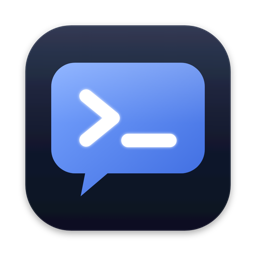
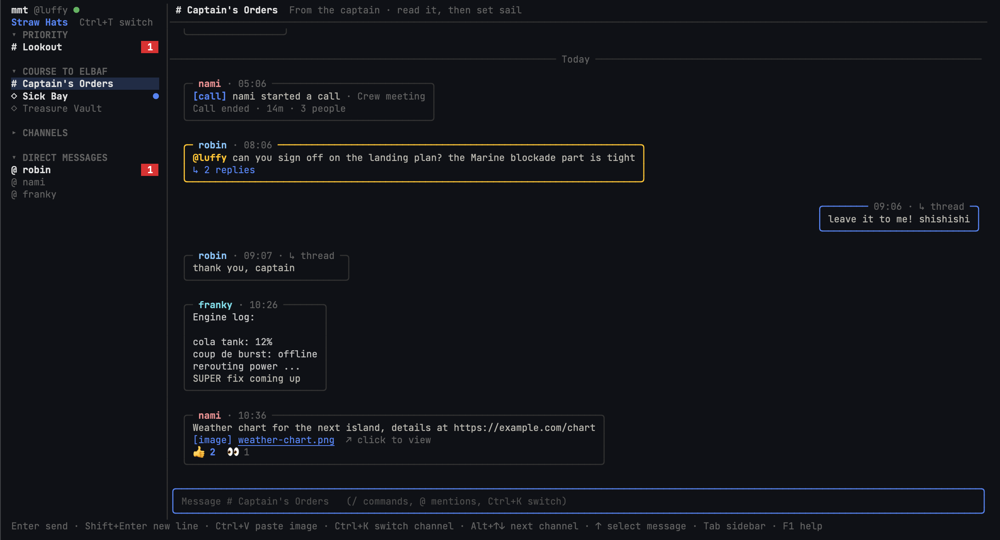

# mmt

Mattermost in the terminal.

I spend most of the day in a terminal and got tired of switching to a browser
tab every time someone pinged me, so I wrote this. It keeps the sidebar the way
you arranged it on the web, opens threads in a panel on the right, and shows
images inline if you're on iTerm2.

[Tiếng Việt](README.vi.md)



It's young. I use it every day against a real server, but expect rough edges,
and please open an issue when you hit one.

## Install

Grab the archive for your machine from the
[releases page](https://github.com/codihaus/mmt/releases). The macOS one works
on both Apple silicon and Intel.

```sh
tar -xzf mmt-macos-*.tar.gz && sh mmt-macos/install.sh
```

The script copies the `mmt` binary to `~/.local/bin`. That's the whole install,
you don't need Go or anything else. The binary isn't notarized yet, which is
why it goes through the terminal: double-clicking it gets you a Gatekeeper
warning.

If you'd rather build it yourself (Go 1.26.7+):

```sh
go install github.com/codihaus/mmt@latest
```

I mostly run it on macOS. Linux works too; it uses `xdg-open`, `wl-copy` or
`xclip`, and `notify-send` when they're around. Pasting images from the
clipboard is Mac only for now.

## First run

```sh
mmt login
mmt
```

`mmt login` asks for your server and a personal access token (Profile →
Security → Personal Access Tokens in Mattermost). Username and password work
too, MFA included. The token is stored in the system keychain.

No server handy? `make demo` starts a fake one from `tools/mockserver` and
points mmt at it.

## Using it

The basics work like any chat app: type and press Enter, `Shift+Enter` for a
new line. `Ctrl+K` jumps to a channel or person, and it doesn't care about
accents, so `co hoi` finds `Cơ hội`. It also finds channels you haven't joined
yet.

The mouse works. Click a channel to open it, click a message twice to open its
thread, scroll with the wheel, drag to select text. Paste a screenshot with
`Ctrl+V` or drop a file on the window to attach it.

| Key | |
| --- | --- |
| `Enter` / `Shift+Enter` | Send / new line. If your terminal eats `Shift+Enter`, type `\` then `Enter` |
| `Ctrl+K` | Find a channel or person |
| `Alt+↑` `Alt+↓` | Previous / next channel (also `Ctrl+P` / `Ctrl+N`) |
| `Alt+A` | Next unread |
| `Ctrl+T` | Next team |
| `↑` on an empty input | Select messages. `Enter` opens the thread, `o` opens the attachment, `y` copies the link, `w` opens it in the browser |
| `Tab` | Move between sidebar, channel and thread |
| `Esc` | Close whatever is open |
| `Ctrl+L` | Lock (once you've set up `mmt lock`) |
| `F1` | Everything else |

### Commands

Type `/` to see them all. The ones I added for admin chores open a little form
that asks for one thing at a time and suggests people and channels as you
type, because I could never remember the syntax either. If you do type the
arguments (`/channel new Marketing --private`), the form skips what you
already gave it. Anything destructive asks first.

- `/channel new | rename | info | archive`
- `/add @someone`, `/remove @someone`, `/team add @someone`
- `/dm @a @b` for a DM, or a group DM with more than one name
- `/user @someone`
- `/bot new | list | token | add` and `/token new | list | revoke`
- `/open` and `/link` open or copy the web link to the current channel or thread
- `/call` joins the call in the current channel

New tokens show up once and go straight to your clipboard. They're never posted
anywhere. Any command mmt doesn't know goes to the server, so `/away`,
`/header` and friends still work.

### Running shell commands

Start a message with `!` to run it on your machine instead of sending it:
`!git log -3`, `!open ~/Downloads`. The output shows up in a popup and stays
on your machine unless you press `Enter`, which posts it as a code block.
Commands that print nothing just close the popup. There's no keyboard input,
so `vim` or `ssh` won't work here, and anything still running after 60
seconds is stopped. To send a message that really starts with `!`, write `\!`.

### Calls

A terminal can't do audio, so mmt doesn't try. Calls show up as cards, you get
a notification when someone calls you in a DM, and clicking the card (or
`/call`) opens the channel in the Mattermost desktop app so you can join from
there.

### Notifications when mmt is closed

```sh
mmt background on
```

This starts a small background agent (a LaunchAgent, so it comes back after
a reboot) that stays connected and shows a macOS notification for mentions,
DMs and incoming calls even when no mmt window is open. Click one and mmt
opens on that channel. While mmt is open the agent keeps quiet, so you never
get the same message twice. macOS asks once whether mmt may send
notifications; say yes. `mmt background status` tells you if it's running,
and `mmt background off` removes it. `mmt setup` asks about this too.

## Cmd keys on macOS

Terminal.app keeps every `Cmd` shortcut for its own menus, so no program
running inside it ever sees `Cmd+K`. iTerm2 and Ghostty can pass them through.
If you have either one, `mmt` reopens itself there with `Cmd+K`, `Cmd+V`,
`Cmd+T`, `Cmd+↑/↓` and `Shift+Enter` mapped.

On iTerm2 that means a separate profile called `mmt` (a Dynamic Profile).
Your own profiles aren't touched. Ghostty just gets the keys as command-line
flags.

`mmt --here` stays in the current terminal. It never moves itself out of tmux,
screen, zellij or an SSH session.

## App lock

`mmt lock` sets up a lock that's separate from your Mattermost login: Touch ID
with a passcode fallback, or a passcode only. After that mmt asks before
showing anything, `Ctrl+L` locks it right away, and it locks itself after
however many idle minutes you choose. Notifications only say "New message"
while it's locked. The passcode is kept as a PBKDF2 hash in the keychain.

## Config

Everything lives in `~/.config/mmt/config.json`, and `mmt setup` changes the
common bits for you.

| Key | |
| --- | --- |
| `server_url` | Written by `mmt login` |
| `language` | `en` or `vi`. Empty follows `LANG` |
| `terminal` | `auto`, `iterm2`, `ghostty` or `current` |
| `browser` | App to open links with, e.g. `"Google Chrome"`. Empty means the default browser |
| `lock`, `lock_after_minutes` | Written by `mmt lock` |

A few environment variables override it: `MMT_URL` and `MMT_TOKEN` (handy for
scripts and the demo), `MMT_LANG`, `MMT_NO_IMAGES=1` to turn off inline
images, and `MMT_MULTIPLEXER=1` if you run some multiplexer mmt doesn't
recognise.

## Security

Anything other people write (messages, names, channel headers, file names)
has terminal control characters stripped before it's drawn. A message can't
change your window title, write to your clipboard or send escape codes to
iTerm2. Attachments you open with `o` are downloaded to a private temp folder
and flagged for Gatekeeper. Images, PDFs, text and media open directly; any
other file type is only revealed in Finder.

If you find a security problem, please report it through
[a private advisory](https://github.com/codihaus/mmt/security/advisories/new)
instead of a public issue.

## Hacking on it

```sh
make test          # go test -race ./...
make lint          # vet, staticcheck, gofmt
make demo          # fake server + mmt
make video-server  # scripted scenario I use for screen recordings
make video         # mmt pointed at it
```

More in [CONTRIBUTING.md](CONTRIBUTING.md).

## License

Apache 2.0, see [LICENSE](LICENSE).
